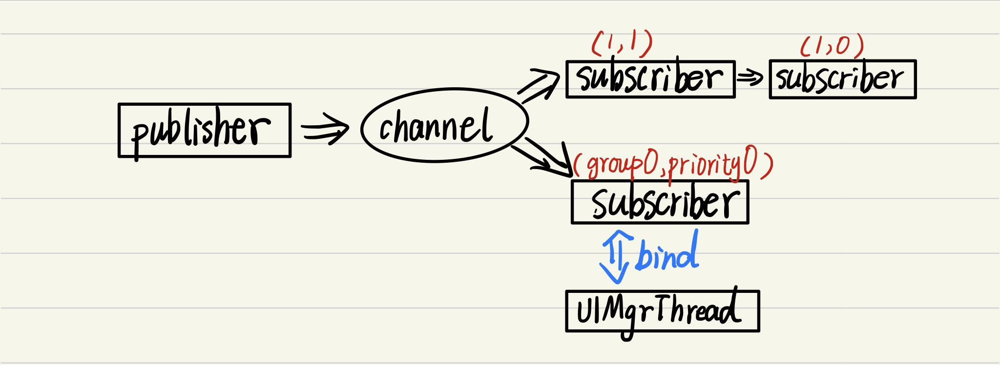
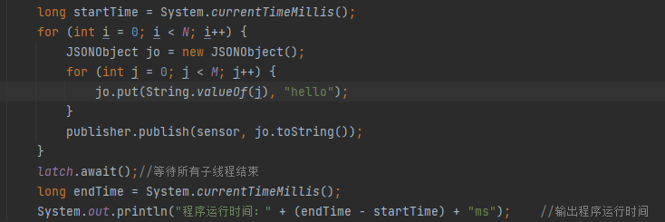
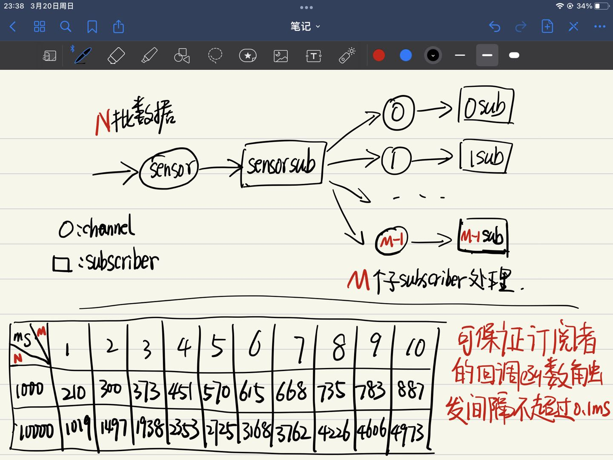
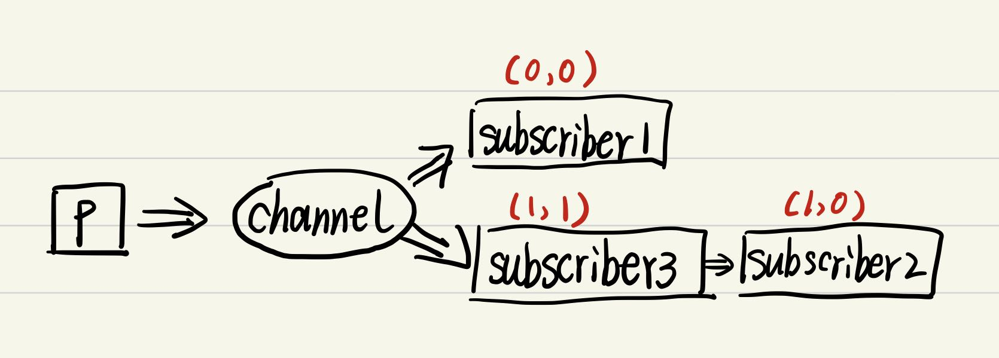

# platform

## pubsub



pubsub机制整体架构如上图：

1. Publisher负责向Channel发送消息;

2. Channel负责转发Publisher发送的消息给Subscriber、记录相关Subscriber的分组及优先级关系；

3. Subscriber负责接收并处理Channel转发的Publisher的消息，还可以和线程（各种MgrThread、App）进行绑定，这样在触发onMessage回调函数时就可以访问相关线程的资源了（当然要注意并发问题）。

### channel

关于分组、优先级的设定：不同组的subscriber接收消息相互独立不影响，同一组的subscriber间消息会被优先级最高的subscriber截取（即只被优先级最高的subscriber接收）， **其中数字越大优先级越高**。

```java
public class GrpPrioPair {
    public int groupId;
    public int priorityId;
}

@Nullable
public GrpPrioPair getGrpPrio(AbstractSubscriber s);
/*此函数可以获取subscriber的分组、优先级信息，
返回null时表示该subscriber没有订阅该channel*/
```

### publisher

```java
public void publish(Channel channel, String message);
/*publisher会向channel中所有group的subscriber发送消息
（当然同一组的消息只会被最高优先级的subscriber接收）*/

public void publish(Channel channel, int groupId, String message)
/*publisher只会向channel中指定group的subscriber发送消息
（当然同一组的消息只会被最高优先级的subscriber接收）*/

public void publish(Channel channel, int groupId, int priorityId, String message);
/*publisher只会向channel中指定group的指定优先级及以下的subscriber发送消息
比如sensor频道的group0有三个subscriber0、1、2，优先级依次是0、1、2，
那么当publish(sensor, 0, 1, message)时只会看优先级1以下的subscriber1和subscriber0，
而subscriber1的优先级高于subscriber0.所以只有subscriber1接收到此message*/
```

### subscriber

这里说明的是AbstractSubscriber类，该类规定了subscriber类共有的属性功能，没有实现onMessage等回调函数，具体到每个subscriber的回调函数要干什么需要我们再实现继承AbstractSubscriber类。

```java
public void subscribe(Channel channel);
/*channel会调用genNewGroupId新建一个group让该subscriber来订阅，且优先级为0*/

public void subscribe(Channel channel, int groupId);
/*channel会让subscriber订阅指定的group，且优先级是0*/

public void subscribe(Channel channel, int groupId, int priorityId);
/*channel会让subscriber订阅指定的group的指定优先级*/

public void bind(Runnable thread);
/*channel和线程进行绑定，方便后续触发onMessage回调函数时可以访问该线程资源*/

/*以下方法是protected，只允许AbstractSubscriber子类访问，
方便在onMessage内部想将处理后的message转发出去的情形*/

protected void publish(Channel channel, String message);

protected void publish(Channel channel, int groupId, String message);

protected void publish(Channel channel, int groupId, int priorityId, String message);
```

下面说明如何继承AbstractSubscriber类：

```java
//Subscriber1
import platform.pubsub.AbstractSubscriber;

public class Subscriber1 extends AbstractSubscriber {
    
    @Override
    public void onMessage(String s, String s2) {
        //接收消息时触发，s为channel，s2为message
    }
    
    @Override
    public void onSubscribed(String s, long l) {
        //当订阅频道时触发，s为channel，l为该subscriber已订阅频道数量
    }

    @Override
    public void onUnsubscribed(String s, long l) {
        //当取消订阅时触发，s为channel，l为该subscriber已订阅频道数量
    }
}
```

### 性能测试





### pubsub示例代码

```java
//Subscriber1
public class Subscriber1 extends AbstractSubscriber {
    @Override
    public void onMessage(String s, String s2) {
        System.out.println("Subscriber1: " + s + ", " + s2);
    }
}

//Subscriber2
public class Subscriber2 extends AbstractSubscriber {
    @Override
    public void onMessage(String s, String s2) {
        System.out.println("Subscriber2: " + s + ", " + s2);
    }
}

//Subscriber3
public class Subscriber3 extends AbstractSubscriber {
    @Override
    public void onMessage(String s, String s2) {
        System.out.println("Subscriber3: " + s + ", " + s2);
    }
}

//TestPubSub
public class TestPubSub {
    public static void main(String[] args) {
        //init
        RedisClient client = RedisClient.create("redis://localhost:6379");
        Publisher.Init(client);
        AbstractSubscriber.Init(client);
        
        Channel channel = new Channel("channel");
        Subscriber1 s1 = new Subscriber1();
        s1.subscribe(channel);
        Subscriber2 s2 = new Subscriber2();
        s2.subscribe(channel);
        Subscriber3 s3 = new Subscriber3();
        GrpPrioPair pair = channel.getGrpPrio(s2);
        s3.subscribe(channel, pair.groupId, pair.priorityId + 1);

        Publisher p = new Publisher();
        p.publish(channel, "hello");

        //close
        Publisher.Close();
        AbstractSubscriber.Close();
    }
}
```

订阅关系：



最终输出结果：

```bash
Subscriber1: channel, hello
Subscriber3: channel, hello
```