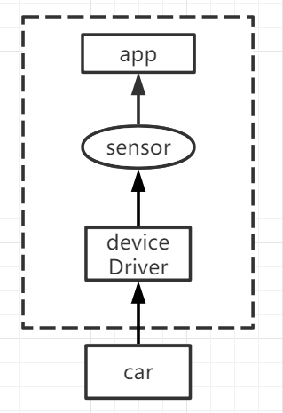
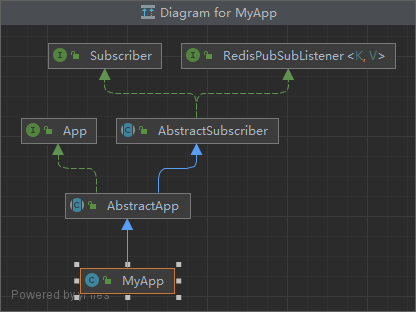

# platform

## 我们能做什么

我们主要提供两种服务：上下文（context）服务以及不变式（invariant）服务。上下文服务用于过滤自身带噪点的数据，不变式服务用于在任务循环中记录变量trace生成不变式以及不变式相关服务。

## 快速开始

按顺序执行下面步骤：

```txt
1. 编写数据来源代码
2. 编写app
3. 编写配置文件
4. 启动redis
5. 启动平台
```

### 1.编写数据来源代码

平台简易数据流转示意如下图：



平台通过DeviceDriver类与外界通信，通信方式为UDP套接字，因此可以兼容不同语言的外部程序。其中udp消息收发相关的配置在配置文件中决定。DeviceDriver接收到外部数据后将数据发布到sensor频道进而让app接收到sensor数据。

例如外部程序是dji的小车程序（python），可通过一下模板和平台进行通信：

```python
import _thread
import socket
import time

def send_msg():
    sk = socket.socket(socket.AF_INET, socket.SOCK_DGRAM)
    addr = ('127.0.0.1', 8082)
    while True:
        time.sleep(0.05)
        msg = "{\"front\": 1.7, \"right\": 147.2, \"back\": 44.7, \"left\": 72.2}"
        sk.sendto(msg.encode(), addr)

def recv_msg():
    sk = socket.socket(socket.AF_INET, socket.SOCK_DGRAM)
    # 绑定 IP 和端口号
    sk.bind(('127.0.0.1', 8083))
    while True:
        # 接收数据报
        msg, addr = sk.recvfrom(1024)
        # 打印
        print('来自[%s:%s]的消息: %s' % (addr[0], addr[1], msg.decode()))

if __name__ == '__main__':
    try:
        _thread.start_new_thread(send_msg, ())
        _thread.start_new_thread(recv_msg, ())
    finally:
        pass
    while True:
        pass
```

其中python程序发送接收的套接字地址和端口应与平台DeviceDriver收发参数保持对应关系。

### 2.编写app

这里的app指能执行任务的循环体，可以简单的理解为一个while循环。用户需要自己继承我们的抽象app类（AbstractSyncApp）来实现自己的应用，继承模板如下：

```java
public class MyApp extends AbstractApp {
    @Override
    public void iter(String channel, String msg) {
        // your task
    }
}
```

iter函数就相当于一个while循环。AbstractApp类继承图如下：



AbstractApp类继承AbstractSubscriber类，AbstractSubscriber是抽象订阅者的意思。平台内部各组件间是通过发布订阅机制来通信的，详情见[pubsub](#pubsub)章节。简单来说，就是MyApp订阅了某个channel后（在配置文件中指定），如sensor channel，一旦sensor channel发布了新的sensor数据后，就会触发MyApp的iter函数。iter此时的`channel == sensor, msg == your_sensor_data`。

### 3.编写配置文件

平台几乎所有配置都可以通过配置文件来修改，配置文件位于`Resources\Configuration`，是一个json的文本文件，记录了所有可配置项目：ctx服务配置、inv服务配置、app配置、资源配置、redis配置。配置文件详细介绍见[configuration](#configuration)章节。这里只做简单介绍：

```json
{
  //......
  "AppConfiguration": [
    {
      "appName": "platform.platform.testunitycar.MyApp",
      "subscribe": [
        {
          "channel": "sensor",
        },
      ],
    },
  ],
  "ResourceConfiguration": {
    "deviceDriver": {
      "serverPort": 8080,
      "clientAddress": "127.0.0.1",
      "clientPort": 8081,
      //......
    },
    //......
  },
  //......
}
```

AppConfiguration是关于app的配置部分，它是个json array，每一项规定了一个app的配置。其中appName就是用户编写app的类名（需要填写完整路径），subscribe就指明了该app订阅的频道。ResourceConfiguration是资源管理的配置部分，其中deviceDriver就规定了udp收发的参数。

### 4.启动redis

因为平台的发布订阅机制是通过对redis的pubsub机制的封装，以及系统的一些存储功能也是通过redis实现，因此在使用平台前需要先启动redis服务。其中配置文件中也指明了redis的配置：

```json
"RedisConfig": {
    "serverAddress": "127.0.0.1",
    "serverPort": "6379",
}
```

### 5.启动平台

启动平台需编写如下入口代码：

```java
public static void main(String[] args) {
    Platform.Init();
    Platform.Start();
}
```

`Init()`完成上次运行冗余文件清除、配置文件读取、redis初始化、各组件线程资源初始化的工作。`Start()`则真正地启动各组件线程。这里的各组件线程指的是：资源管理器线程（resMgr）、服务管理线程（serMgr）、应用管理线程（appMgr）。

### 实例代码

[示例代码](api.md#实例)

## pubsub


pubsub机制整体架构如上图：

1. Publisher负责向Channel发送消息;

2. Channel负责转发Publisher发送的消息给Subscriber、记录相关Subscriber的分组及优先级关系；

3. Subscriber负责接收并处理Channel转发的Publisher的消息，还可以和线程（各种MgrThread、App）进行绑定，这样在触发onMessage回调函数时就可以访问相关线程的资源了（当然要注意并发问题）。

### channel

关于分组、优先级的设定：不同组的subscriber接收消息相互独立不影响，同一组的subscriber间消息会被优先级最高的subscriber截取（即只被优先级最高的subscriber接收）， **其中数字越大优先级越高**。

```java
public class GrpPrioPair {
    public int groupId;
    public int priorityId;
}

@Nullable
public GrpPrioPair getGrpPrio(AbstractSubscriber s);
/*此函数可以获取subscriber的分组、优先级信息，
返回null时表示该subscriber没有订阅该channel*/
```

### publisher

```java
public void publish(Channel channel, String message);
/*publisher会向channel中所有group的subscriber发送消息
（当然同一组的消息只会被最高优先级的subscriber接收）*/

public void publish(Channel channel, int groupId, String message)
/*publisher只会向channel中指定group的subscriber发送消息
（当然同一组的消息只会被最高优先级的subscriber接收）*/

public void publish(Channel channel, int groupId, int priorityId, String message);
/*publisher只会向channel中指定group的指定优先级及以下的subscriber发送消息
比如sensor频道的group0有三个subscriber0、1、2，优先级依次是0、1、2，
那么当publish(sensor, 0, 1, message)时只会看优先级1以下的subscriber1和subscriber0，
而subscriber1的优先级高于subscriber0.所以只有subscriber1接收到此message*/
```

### subscriber

这里说明的是AbstractSubscriber类，该类规定了subscriber类共有的属性功能，没有实现onMessage等回调函数，具体到每个subscriber的回调函数要干什么需要我们再实现继承AbstractSubscriber类。

```java
public void subscribe(Channel channel);
/*channel会调用genNewGroupId新建一个group让该subscriber来订阅，且优先级为0*/

public void subscribe(Channel channel, int groupId);
/*channel会让subscriber订阅指定的group，且优先级是0*/

public void subscribe(Channel channel, int groupId, int priorityId);
/*channel会让subscriber订阅指定的group的指定优先级*/

/*以下方法是protected，只允许AbstractSubscriber子类访问，
方便在onMessage内部想将处理后的message转发出去的情形*/

protected void publish(Channel channel, String message);

protected void publish(Channel channel, int groupId, String message);

protected void publish(Channel channel, int groupId, int priorityId, String message);
```

下面说明如何继承AbstractSubscriber类：

```java
//Subscriber1

import platform.common.pubsub.AbstractSubscriber;

public class Subscriber1 extends AbstractSubscriber {
    @Override
    public void onMessage(String s, String s2) {
        //接收消息时触发，s为channel，s2为message
    }
}
```

### pubsub示例代码

```java
//Subscriber1
public class Subscriber1 extends AbstractSubscriber {
    @Override
    public void onMessage(String s, String s2) {
        System.out.println("Subscriber1: " + s + ", " + s2);
    }
}

//Subscriber2
public class Subscriber2 extends AbstractSubscriber {
    @Override
    public void onMessage(String s, String s2) {
        System.out.println("Subscriber2: " + s + ", " + s2);
    }
}

//Subscriber3
public class Subscriber3 extends AbstractSubscriber {
    @Override
    public void onMessage(String s, String s2) {
        System.out.println("Subscriber3: " + s + ", " + s2);
    }
}

//TestPubSub
public class TestPubSub {
    public static void main(String[] args) {
        //init
        RedisClient client = RedisClient.create("redis://localhost:6379");
        Publisher.Init(client);
        AbstractSubscriber.Init(client);
        
        Channel channel = new Channel("channel");
        Subscriber1 s1 = new Subscriber1();
        s1.subscribe(channel);
        Subscriber2 s2 = new Subscriber2();
        s2.subscribe(channel);
        Subscriber3 s3 = new Subscriber3();
        GrpPrioPair pair = channel.getGrpPrio(s2);
        s3.subscribe(channel, pair.groupId, pair.priorityId + 1);

        Publisher p = new Publisher();
        p.publish(channel, "hello");

        //close
        Publisher.Close();
        AbstractSubscriber.Close();
    }
}
```

订阅关系：


最终输出结果：

```bash
Subscriber1: channel, hello
Subscriber3: channel, hello
```

## configuration

```c
{
  "CtxServerConfiguration": {
    "serverOn": true, //是否开启服务
    "isCtxCleanOn": true,
    "isCtxFixOn": true,
    "CtxCleaner": "ECC+IMD",
    "CtxFixer": "Drop",
    "BUFFER_RAW_MAX": 2,
    "BUFFER_CLEAN_MAX": 50,
    "delay_allowed": 20000, //ms  <= 1000*20
    "dataFile": "data28/wrongData3.txt",
    "changeHandlerType": "static-change-based",
    "logFilePath": "output3.txt",
    "ruleFilePath": "Resources/rules.xml",
    "patternFilePath": "Resources/patterns.xml",
    "oracleFilePath": "oracle.txt",
    //订阅的频道信息
    "subscribe": [
      {
        "channel": "sensor", //频道名
        "priorityId": 1, //优先级
      },
    ],
  },
  "InvServerConfiguration": {
      "serverOn": true, //服务是否开启
      "groupThro": 20, //trace的阈值
      "kMeansGroupSize": 1, //多少条trace
      "dosThro": 0.5, //DoS算法阈值
      //trace文件形式，用以将来要生成不变式，可选csv、daikon、dig
      //详见src\main\java\platform\service\inv\struct\trace
      "groupTraceType": "csv", 
      "invGenMode": "total", //不变式生成模式，total是全量模式，incr是增量模式
      "invGenType": "numeric",//不变式类型，numeric指数值型，更多不变式类型需要后续支持
      "subscribe": [
        {
          "channel": "sensor",
        },
        {
          "channel": "check",
        },
      ],
  },
  //app配置
  "AppConfiguration": [
    {
      "appName": "platform.platform.testunitycar.MyApp",//app名称
      "subscribe": [
        {
          "channel": "sensor",
        },
      ],
    },
  ],
  //资源配置
  "ResourceConfiguration": {
    //设备驱动配置
    "deviceDriver": {
      "serverPort": 8080, //udp接收端口
      "clientAddress": "127.0.0.1",//udp发送地址
      "clientPort": 8081,//udp发送端口
      "subscribe": [
        {
          "channel": "actor",
        },
        {
          "channel": "check",
        }
      ],
    },
    //数据库驱动，将频道数据写进redis里面
    "databaseDriver": {
      "subscribe": [
        {
          "channel": "sensor",
        },
        {
          "channel": "actor",
        },
        {
          "channel": "check",
        },
        {
          "channel": "ctxStat",
        },
      ],
    },
    //传感器配置，ctx服务、inv服务会读取该项
    "SensorConfiguration": [
      {
        "sensorName": "front",
      },
      {
        "sensorName": "back",
      },
      {
        "sensorName": "left",
      },
      {
        "sensorName": "right",
      }
    ],
    //动作设施配置
    "ActorConfiguration": [
      {
        "actorName": "x",
      },
      {
        "actorName": "y",
      },
      {
        "actorName": "z",
      },
    ],
  },
  //redis配置
  "RedisConfig": {
    "serverAddress": "127.0.0.1",
    "serverPort": "6379",
  }
}
```

## context

## invariant

## log system

## resource manage

平台和外部程序通信采用TCP明文协议。明文协议格式为：

```txt
平台发送协议格式：
{"cmd": "XXX", "message": "XXX"}
```

其中平台接收的协议格式中**cmd**、**message**项需与发送协议格式中的保持一致。

### 明文协议

| direction | cmd             | message                                                              |
|-----------|-----------------|----------------------------------------------------------------------|
| W -> P    | register        | DeviceConf的json串                                                     |
| P -> W    | register_back   | true 或者 false                                                        |
| P -> W    | sensory_request | {...}//用户自定义                                                         |
| W -> P    | sensory_back    | {"default":"100"}//单域传感器<br/>或者{"speed":100,"longitude":22.3}//多域传感器 |
| P -> W    | action_request  | {...}//用户自定义                                                         |
| W -> P    | action_back     | true 或者 false                                                        |
| W -> P    | shutdown        | null                                                                 |

#### SensorConf

```json
{
  "name":  "XXXX",
  "deviceType":  "XXXX",
  "valueType": "XXXX",
  "fields": ["XXXX", "XXXX", "XXXX"]
}
```

#### ActorConf

```json
{
  "name":  "XXXX",
  "deviceType":  "XXXX",
  "valueType": "XXXX"
}
```

## app

app与平台通信为tcp通信

### app与平台通信明文协议

| 类名              | 编程API                                                                              | App -> Platform                                                                   | Platform -> App                                                                    |
|-----------------|------------------------------------------------------------------------------------|-----------------------------------------------------------------------------------|------------------------------------------------------------------------------------|
| RemoteConnector | public boolean connectPlatform(String ip, int port);                               | {"api":"connect"}                                                                 | {"state":true/false}                                                               |
| RemoteConnector | public boolean disConnectPlatform();                                               | {"api":"disconnect"}                                                              | {"state":true/false}                                                               |
| RemoteConnector | public boolean checkConnected();                                                   | {"api":"is_connected"}                                                            | {"state":true/false}                                                               |
| RemoteConnector | public boolean registerApp(AbstractApp app);                                       | {"api":"register_app","app_name":"xxxx"}                                          | {"state":true/false,"udp_port":xxxx}                                               |
| RemoteConnector | public boolean unregisterApp(AbstractApp app);                                     | {"api":"unregister_app","app_name":"xxxx"}                                        | {"state":true/false}                                                               |
| RemoteConnector | public Map<String, SensorInfo> getSupportedSensors();                              | {"api":"get_supported_sensors"}                                                   | [{"sensor_name":"xxxx","state":"on/off","value_type":"xxxx"},...]                  |
| RemoteConnector | public Map<String, SensorInfo> getRegisteredSensors();                             | {"api":"get_registered_sensors"}                                                  | [{"sensor_name":"xxxx","state":"on/off","value_type":"xxxx"},...]                  |
| RemoteConnector | public boolean getRegisteredSensorsStatus();                                       | {"api":"get_registered_sensors_status"}                                           | {"state":true/false}                                                               |
| RemoteConnector | public boolean registerSensor(String sensorName, SensorMode mode, int freq);       | {"api":"register_sensor","sensor_name":"xxxx","mode":"xxxx","freq":xxxx}          | {"state":true/false}                                                               |
| RemoteConnector | public boolean cancelSensor(String sensorName);                                    | {"api":"cancel_sensor","sensor_name":"xxxx"}                                      | {"state":true/false}                                                               |
| RemoteConnector | public boolean cancelAllSensors();                                                 | {"api":"cancel_all_sensors"}                                                      | {"state":true/false}                                                               |
| RemoteConnector | public String getSensorData(String sensorName);                                    | {"api":"get_sensor_data","sensor_name":"xxxx"}                                    | {"default":"value"} / {"field1":"value1",...}                                      |
| RemoteConnector | public Map<String, String> getAllSensorData();                                     | {"api":"get_all_sensor_data"}                                                     | [{"sensor_name":"xxxx","value":{"default":"value"} / {"field1":"value1",...}},...] |
| RemoteConnector | public boolean getMsgThread(CmdType cmd);                                          | {"api":"get_msg_thread","cmd":"xxxx"}                                             | {"state":true/false}                                                               |
| RemoteConnector | public Map<String, ActorInfo> getSupportedActors();                                | {"api":"get_supported_actors"}                                                    | [{"actor_name":"xxxx","state":"on/off","value_type":"xxxx"},...]                   |
| RemoteConnector | public Map<String, ActorInfo> getRegisteredActors();                               | {"api":"get_registered_actors"}                                                   | [{"actor_name":"xxxx","state":"on/off","value_type":"xxxx"},...]                   |
| RemoteConnector | public boolean getRegisteredActorsStatus();                                        | {"api":"get_registered_actors_status"}                                            | {"state":true/false}                                                               |
| RemoteConnector | public boolean registerActor(String actorName);                                    | {"api":"register_actor","actor_name":"xxxx"}                                      | {"state":true/false}                                                               |
| RemoteConnector | public boolean cancelActor(String actorName);                                      | {"api":"cancel_actor","actor_name":"xxxx"}                                        | {"state":true/false}                                                               |
| RemoteConnector | public boolean cancelAllActors();                                                  | {"api":"cancel_all_actors"}                                                       | {"state":true/false}                                                               |
| RemoteConnector | public boolean setActorCmd(String actorName, String action)                        | {"api":"set_actor_cmd","actor_name":"xxxx","action":"xxxx"}                       | {"state":true/false}                                                               |
| RemoteConnector | public boolean isServiceOn(ServiceType service);                                   | {"api":"is_service_on","service_type":"xxxx"}                                     | {"state":true/false}                                                               |
| RemoteConnector | public boolean serviceStart(ServiceType service, ServiceConfig config);            | {"api":"start_service","service_type":"xxxx","config":<config>}                   | {"state":true/false}                                                               |
| RemoteConnector | public boolean serviceStop(ServiceType service);                                   | {"api":"stop_service","service_type":"xxxx"}                                      | {"state":true/false}                                                               |
| RemoteConnector | public String serviceCall(ServiceType service, CmdType cmd, ServiceConfig config); | {"api":"service_call","service_type":"xxxx","cmd_type":"xxxx","config":<config>}  | {"state":true/false}                                                               |
| RemoteConnector | public boolean setRuleFile(String ruleFile);                                       | {"api":"set_rule_file","file_name":"xxxx","content":"xxxx"}                       | {"state":true/false}                                                               |
| RemoteConnector | public boolean setPatternFile(String patternFile);                                 | {"api":"set_pattern_file","file_name":"xxxx","content":"xxxx"}                    | {"state":true/false}                                                               |
| RemoteConnector | public boolean setBfuncFile(String bfuncFile);                                     | {"api":"set_bfunc_file","file_name":"xxxx","content":"xxxx"}                      | {"state":true/false}                                                               |
| RemoteConnector | public boolean setMfuncFile(String mfuncFile);                                     | {"api":"set_mfunc_file","file_name":"xxxx","content":"xxxx"}                      | {"state":true/false}                                                               |
| RemoteConnector | public boolean setRfuncFile(String rfuncFile);                                     | {"api":"set_rfunc_file","file_name":"xxxx","content":"xxxx"}                      | {"state":true/false}                                                               |
| RemoteConnector | public boolean setCtxValidator(String ctxValidator);                               | {"api":"set_ctx_validator","ctx_validator":"xxxx"}                                | {"state":true/false}                                                               |
| InvCheck        | public boolean monitor(Object... objs);                                            | {"api":"inv_monitor","objs":["XXXX",...]}                                         | {"state":true/false}                                                               |
| InvCheck        | public boolean isMonitored(Object... objs);                                        | {"api":"inv_is_monitored","objs":["XXXX",...]}                                    | {"state":true/false}                                                               |
| InvCheck        | public boolean check(Object... objs);                                              | {"api":"inv_check","objs":{"XXXX":XXXX,...},"line_number":XXXX,"check_time":XXXX} | {"state":true/false}                                                               |

#### <config>

CtxServiceConfig

```json
{
  "rule_file_content": "xxxx",
  "pattern_file_content": "xxxx",
  "bfunc_file_content": "xxxx",
  "mfunc_file_content": "xxxx",
  "rfunc_file_content": "xxxx",
  "ctx_validator": "xxxx"
}
```

InvServiceConfig

```json

```


