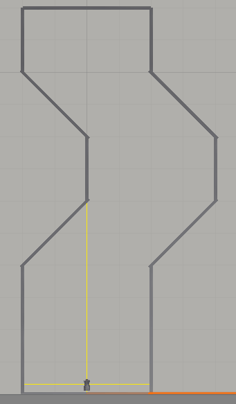

# api

## log system

日志系统使用api，用于调试，具体采用`common-logging+log4j`来实现。消息优先级从大到小：error > warn > info > debug。具体会生成debug.log、info.log、warn.log、error.log四个日志文件。配置文件在`Resources\log4j.properties`。

```java
//记录在debug.log中，且不会输出到控制台
logger.debug(String msg);

//记录在debug.log、info.log中，且会输出到控制台
logger.info(String msg);

//记录在debug.log、info.log、warn.log中，且会输出到控制台
logger.warn(String msg);

//记录在debug.log、info.log、warn.log、error.log中，且会输出到控制台
logger.error(String msg);
```

## pubsub

平台内部消息通信机制，通过封装redis的pubsub机制实现。

### subscriber

指`AbstractSubscriber`类的子类，其中AbstractSyncApp、AbstractAsyncApp、DBDriver、DeviceDriver、CancerServer、CxtSubscriber类都是AbstractSubscriber的子类，因此具有共同属性。btw，在AbstractSubscriber类中定义了一个Publisher变量，方便在onMessage函数中直接使用发布者功能。

```java
//订阅某个频道
public void subscribe(Channel channel);

//订阅某个频道，指定到某个分组
public void subscribe(Channel channel, int groupId);

//订阅某个频道，指定到某个分组以及优先级
public void subscribe(Channel channel, int groupId, int priorityId);

//获取在某个频道的groupId以及priorityId。null则代表没订阅该频道
@Nullable
public GrpPrioPair getGrpPrioPair(Channel channel)

//当订阅的频道来新消息时触发，channel为频道名称，msg为具体消息
void onMessage(String channel, String msg);

//获取订阅者名称
public String getName();
```

### channel

指Channel类。

```java
//获取channel实例，如果不存在该实例，则生成新实例再返回
public static Channel get(String channelName);

//返回所有订阅该频道的订阅者，Map第一维是groupId，第二维是priorityId
public Map<Integer, Map<Integer, List<AbstractSubscriber>>> getSubscribers();

//获取频道的名称
public String getName();

//返回某个订阅者再该频道的groupId以及priorityId。如果返回null则代表该订阅者没订阅该频道
@Nullable
public GrpPrioPair getGrpPrio(AbstractSubscriber s)
```

### publisher

指Publisher类。

```java
//发布message到channel
public void publish(Channel channel, String message);

//发布message到channel，只有指定group的订阅者才能接收到
public void publish(Channel channel, int groupId, String message);

/*publisher只会向channel中指定group的指定优先级及以下的subscriber发送消息
比如sensor频道的group0有三个subscriber0、1、2，优先级依次是0、1、2，
那么当publish(sensor, 0, 1, message)时只会看优先级1以下的subscriber1和subscriber0，
而subscriber1的优先级高于subscriber0.所以只有subscriber1接收到此message*/
public void publish(Channel channel, int groupId, int priorityId, String message);
```

## invariant

指CancerObject、CancerArray类。invariant服务指的是check()接口。该接口是通过特殊的变量CancerObject来调用。CanerObject可以看作是Double类的扩展，记录了name、value、appName、checkId、iterId等基本属性。CancerArray则是CancerObject的列表类。

### CancerObject

```java
//获取CancerObject实例，如果不存在则生成新实例返回
public static CancerObject get(String name);

//判断是否存在CancerObject实例
public static boolean contains(String name);

//获取名称
public String getName();

//获取iterId
public String getIterId();

//获取checkId
public int getCheckId();

//获取所在的app
public String getAppName();

//获取值
public double getValue();

//设置值
public void setValue(double value);

//调用check，返回checkinfo
public CheckInfo check();

public static CheckInfo[] check(CancerObject... args);

public static CheckInfo[] check(List<CancerObject> args);
```

### CancerArray

```java
//解析json array字符串成CancerArray
public static CancerArray fromJsonObjectString(String jsonObjectString);

//根据index获取CancerObject
public CancerObject get(int index);

//根据name获取CancerObject，返回null代表无此CancerObject
@Nullable
public CancerObject get(String name);

//判断是否为空
public boolean isEmpty();

//调用check，返回checkinfo[]
public CheckInfo[] check();
```

### CheckInfo

```java
public enum CheckState {
    TRACE_COLLECT,    //trace收集中
    INV_GENERATING,   //inv生成中
    INV_GENERATED,    //inv生成成功
    INV_VIOLATED,     //inv被违反
    INV_NOT_VIOLATED, //inv没有被违反
}

public class CheckInfo {
    public String appName;//app名称
    public int iterId;//第几次迭代
    public int lineNumber;//check行号
    public int checkId;//第几次check
    public long checkTime;//check时间

    public String name;//CancerObject的名字
    public double value;//CancerObject的值

    public CheckState checkState;//check状态
    public double diff;//checkState == CheckState.INV_VIOLATED时，diff为value和inv的差值
}
```

## context

指CtxInteractor类， 该类是上层app与上下文模块交互的途径，每个app实例中包含了一个CtxInteractor的实例ctxInteractor,为上层app提供了如下api

```java
//查看平台所有sensor信息
public Map<String, SensorInfo> getSupportedSensors();

//查看注册监听的所有sensor信息
public Map<String, SensorInfo> getRegisteredSensors();

//注册监听某一sensor
public boolean registerSensor(String sensorName);

//取消监听某一sensor
public boolean cancelSensor(String sensorName);

//获取某一sensor对应的值
public String getSensor(String sensorName);

//获取监听的所有sensor及其对应的值
public String getMsg();
```

其中SensorInfo类如下

```java
public final String State; //Sensor的状态 On 或者 Off
public final String valueType; //Sensor的数据类型

public String getState();
public String getValueType();
```


## 实例

### 小车避障app

让unity小车在下图场景中一直先前跑，且不会撞到左右墙壁：


这里我们规定小车发送的数据形式如下：

> {"front": 1.7, "right": 147.2, "back": 44.7, "left": 72.2}

小车接收的数据形式如下：

> {"xSpeed": 2.0, "ySpeed": 0.0, "zSpeed": 0.0}

程序设计思路：首先一直让小车向前跑，即设置xSpeed=5，在一开始跑的时候通过调用check接口不断记录小车四个传感器的trace，trace到达阈值后开始生成不变式。当进入新环境后，如果left的值小于不变式时，则让他向右偏，当left的值大于不变式时，让它向左偏。

```java
//MySyncApp.java
package platform.testunitycar;

public class MySyncApp extends AbstractSyncApp {
    public MySyncApp(){
        ctxInteractor.registerSensor("left");
    }

    @Override
    public void iter(String channel, String msg) {
        //此处msg为该app监听的所有sensor的JsonString
        logger.debug("app recv: " + msg);
        Actor actor = new Actor(5, 0, 0);

        //method 1: 将msg转为CancerArray
//        CancerArray ca = CancerArray.fromJsonObjectString(msg);
//        CancerObject left = ca.get("left");
        //method 2: 通过ctxInteractor直接获取需要的单个sensor,并转为CancerObject
        CancerObject left = CancerObject.fromJsonObjectString(ctxInteractor.getSensor("left"));//{"left": 10}
        CheckInfo checkInfo = left.check();
        logger.debug("check:\n" + JSON.toJSONString(checkInfo, true));
        if (checkInfo.checkState == CheckState.INV_VIOLATED) {
            actor.setYSpeed(-checkInfo.diff);
        }

        publish("actor", JSON.toJSONString(actor));
        logger.debug("actor: " + JSON.toJSONString(actor));
    }
}
```

```txt
//Configuration
{
  "CtxServerConfiguration": {
    "serverOn": true,
    "isCtxCleanOn": true,
    "isCtxFixOn": true,
    "CtxCleaner": "ECC+IMD",
    "CtxFixer": "Drop",
    "BUFFER_RAW_MAX": 2,
    "BUFFER_CLEAN_MAX": 50,
    "delay_allowed": 20000, //ms  <= 1000*20
    "dataFile": "data28/wrongData3.txt",
    "changeHandlerType": "static-change-based",
    "logFilePath": "output3.txt",
    "ruleFilePath": "Resources/rules.xml",
    "patternFilePath": "Resources/patterns.xml",
    "bfuncFilePath": "Resources/Bfunction.class",
    "oracleFilePath": "oracle.txt",
    "subscribe": [
      {
        "channel": "sensor",
        "priorityId": 1,
      },
    ],
  },
  "InvServerConfiguration": {
      "serverOn": true,
      "groupThro": 20,
      "kMeansGroupSize": 1,
      "dosThro": 0.5,
      "groupTraceType": "csv",
      "invGenMode": "total",
      "invGenType": "numeric",
      "subscribe": [
        {
          "channel": "sensor",
        },
        {
          "channel": "check",
        },
      ],
  },
  "AppConfiguration": [
    {
      "appName": "platform.testunitycar.MySyncApp",
      "subscribe": [
        {
          "channel": "sensor",
        },
      ],
    },
  ],
  "ResourceConfiguration": {
    "deviceDriver": {
      "serverPort": 8080,
      "clientAddress": "127.0.0.1",
      "clientPort": 8081,
      "subscribe": [
        {
          "channel": "actor",
        },
        {
          "channel": "check",
        }
      ],
    },
    "databaseDriver": {
      "subscribe": [
        {
          "channel": "sensor",
        },
        {
          "channel": "actor",
        },
        {
          "channel": "check",
        },
        {
          "channel": "ctxStat",
        },
      ],
    },
    "SensorConfiguration": [
      {
        "SensorName": "front",
      },
      {
        "SensorName": "back",
      },
      {
        "SensorName": "left",
      },
      {
        "SensorName": "right",
      }
    ],
    "ActorConfiguration": [
      {
        "ActorName": "x",
      },
      {
        "ActorName": "y",
      },
      {
        "ActorName": "z",
      },
    ],
  },
  "RedisConfig": {
    "serverAddress": "127.0.0.1",
    "serverPort": "6379",
  }
}
```

运行结果：

