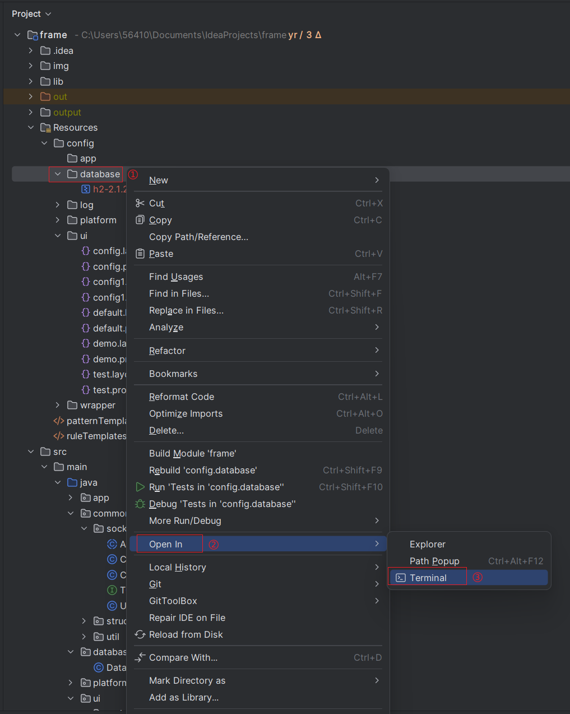
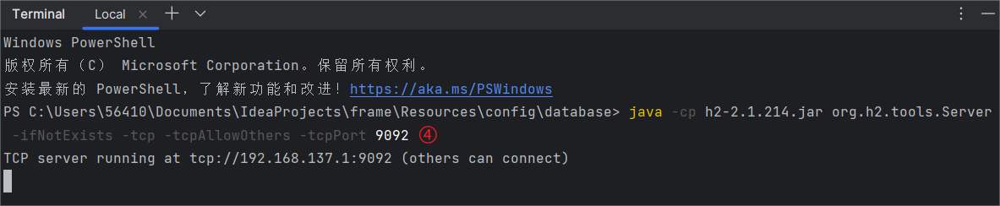

# DataBase

## 引言

DataBase我们采取的是`H2`的数据库，用于存储平台运行过程中产生的数据。采用H2数据库理由如下：

1. H2数据库是一个嵌入式数据库，可以直接将其打包到项目中，不需要单独安装，使用方便。
2. H2数据库支持TCP连接及多线程访问，可以通过TCP连接进行远程访问。
3. H2数据库支持内存模式，可以将数据库存储在内存中，提升访问速度。
4. 当H2数据库同时开启TCP模式和内存模式时，数据库存在一个引用计数，当最后一个连接断开时，数据库会自动关闭，数据历史数据自动清除。方便平台断连时UI依旧能够访问数据库，而且不会造成数据库数据冗余。

## 启动数据库服务器

首先保证在终端里可以使用Java，在终端输入`java --version`，如果有输出那就ok。

然后在Terminal中转到`Resources/config/database`目录下，运行`java -cp h2-2.1.214.jar org.h2.tools.Server -ifNotExists -tcp -tcpAllowOthers -tcpPort $port`，启动数据库服务器，其中`$port`为数据库服务器端口号，可以自行指定。当终端显示`TCP server running at tcp://192.168.137.1:$port (others can connect)`时，表示数据库服务器启动成功。

关闭数据库服务器只需要在终端中按`Ctrl+C`即可。





## API列表(Database.java)

* `public static void Init(int port, String database);`

    描述：初始化数据库，启动数据库服务器，创建数据库连接。

    参数：port：数据库服务器端口号;database：数据库名称，如果不存在则创建，如果存在则连接
    
    返回值：无

* `public static void Close();`

    描述：关闭数据库连接，关闭数据库服务器。

    参数：无

    返回值：无

* `public static boolean Set(String sql);`

    描述：执行SQL语句，用于插入、更新、删除数据。

    参数：sql：SQL语句

    返回值：执行成功返回true，否则返回false

* `public static QueryResult Get(String sql);`

    描述：执行SQL语句，用于查询数据。

    参数：sql：SQL语句

    返回值：执行成功返回查询结果，否则返回null。结构体QueryResult定义见[QueryResult.java](./src/main/java/database/struct/QueryResult.java)

## 示例

代码：

```java
import database.struct.QueryResult;

import java.sql.ResultSet;
import java.sql.SQLException;
import java.util.Arrays;

public class test {
  public static void main(String[] args) throws SQLException {
    Database.Init(9092, "school");

    Database.Set("CREATE TABLE IF NOT EXISTS student (id INT PRIMARY KEY, name VARCHAR(255))");
    Database.Set("INSERT INTO student VALUES (1, '张三')");
    Database.Set("INSERT INTO student VALUES (2, '李四')");

    QueryResult qr = Database.Get("SELECT * FROM student");
    System.out.println(qr);
    Database.Close();
  }
}
```

结果：

```text
[ID, NAME]
[1, 张三]
[2, 李四]
```

