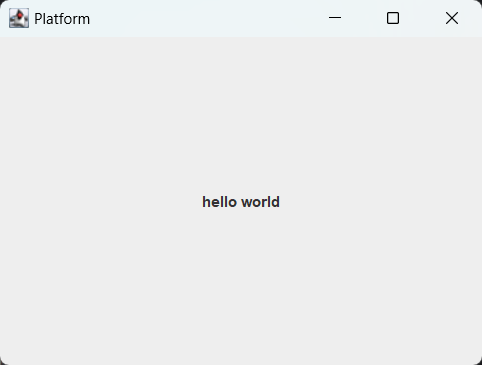
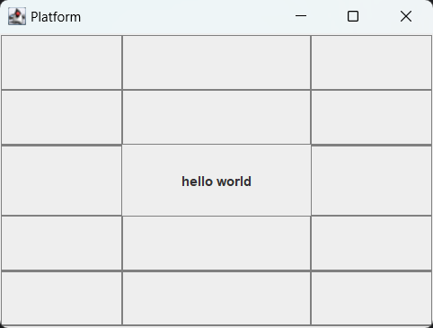
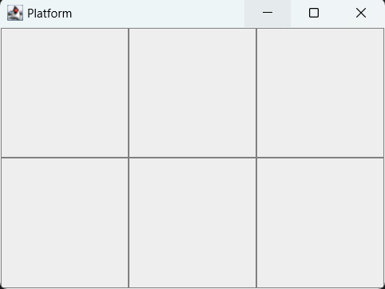
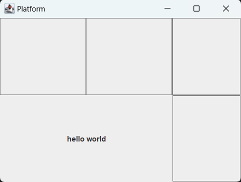
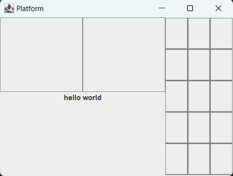

# UI

## 引言

本文档将介绍平台的UI模块，包括UI是如何工作的，如何配置UI，以及UI的API列表等等。本文档涉及到的基本术语定义如下:

* `组件`: 例如Button、Label、Image等等。
* `页面`: 容纳组件的角色。一个页面可以包含多个组件，但是一个组件只能属于一个页面。页面可以理解为一个容器，用于容纳组件。
* `格栅布局`: 页面的布局方式。格栅布局将页面划分为若干行和若干列形成格栅形状，组件可以放置在格栅的任意位置。
* `Window`: 窗口组件，是页面的一种。窗口是最基础的组件，默认在右上角包含了最小化、最大化、关闭三个按钮，它只能作为页面去容纳其他组件，但是不能作为组件放在其他页面之上。
* `Panel`: 面板组件，是页面的一种。面板既可以作为组件分布在其他页面之上，也可以本身作为页面容纳其他组件。
* `xxx.uc`: UI配置文件（UI configuration）。格式为json，指明了UI的一些基本配置，例如数据库端口号、ul文件路径、up文件路径等等。
* `xxx.ul`: 页面布局文件（UI layout）。格式为json，包含了一个json array，array中每一项都是一个页面的布局信息。
* `xxx.up`: 组件属性文件（UI property）。格式为json，包含了一个json array，array中每一项都是一个组件的属性配置信息。用户可以对组件的属性值进行静态设置，或者对属性进行动态的数据绑定，以及设定组件的监听事件和动作。
* `数据绑定`: 指组件的属性值（例如Label组件的text属性）可以和数据库中的数据源进行绑定。组件会根据用户设定的频率去查询数据库，然后将数据库中的数据更新到组件的属性值中。
* `事件监听`: 指组件可以监听的事件，例如Button的点击事件等等。
* `动作`: 指当监听的事件发生时执行的动作，例如Button的点击动作发生后，可以执行一个动作，例如弹出一个对话框等等。

下面我将从运行步骤、xxx.uc、xxx.ul、xxx.up、常见问题五个方面来介绍UI模块。

## 运行步骤

在使用UI模块之前，需要先准备好以下几个文件:

* xxx.uc
* xxx.ul
* xxx.up

然后就是确保运行UI前，数据库已经启动了。数据库的启动方式请参考[启动数据库服务器](database.md#启动数据库服务器)。

最后就是在UI.java的main函数中调用UI.Start()的地方传入xxx.uc的路径，例如:

```java
UI.Start("Resources/config/ui/default.uc");
```

## xxx.uc

uc文件是UI的配置文件(UI configuration)，它的格式为json，包含了以下几个字段:

* `databse_name`: 数据库名称。
* `database_port`: 数据库端口号。
* `layout_file`: 页面布局文件的路径。
* `property_file`: 组件属性文件的路径。
* `grid_visible`: 是否让UI的格栅布局可视化。
    
  不可视化(`false`):

  

  可视化(`true`):

  

下面是一个uc文件的示例:

```json
{
    "database_name": "test",
    "database_port": 9092,
    "layout_file": "Resources/config/ui/default.ul",
    "property_file": "Resources/config/ui/default.up",
    "grid_visible": true
}
```

## xxx.ul

ul文件是UI的页面布局文件(UI layout)，它的格式为json，包含了一个json array，array中每一项都是一个页面的布局信息。每一个页面的布局信息包含了以下几个字段:

* `type`: 页面的类型，有两种类型，一种是`Window`，一种是`Panel`。
* `id`: 页面的id，用于唯一标识一个页面。
* `size`: 页面的栅格大小，格式为`[width, height]`。

  例如`[3, 2]`表示页面的宽度为3，高度为2，即占据了2行3列的格栅:

    

* `components`: 页面包含的所有组件。这是一个json array，array的每一项表示一个组件。每一个组件包含了以下几个字段:
  * `type`: [组件类型](#组件类型)，例如`Button`、`Label`、`Image`等等。
  * `id`: 组件的id，用于唯一标识一个组件。
  * `position`: 组件的位置，格式为`[x, y, w, h]`。`x`和`y`表示组件的格栅坐标，`w`和`h`表示组件占据的格栅宽度和高度。
    > 注意在前端的坐标系中，原点在页面的左上角，x轴向右，y轴向下。

    例如`[0, 1, 2, 1]`表示组件位于第2行第1列的格栅中，并且宽度占据2个格栅，高度占据1个格栅:

    

  * `align`: 组件的[对齐方式](#对齐方式)，例如`Center`、`North`、`NorthWest`等等。 

    例如`NORTH`表示组件向上对齐:

    

> 注意！ul文件第一个页面type必须是Window且id必须是main，这是UI的主窗口。

下面是一个ul文件的示例:

```json
[
  {
    "type": "Window",
    "id": "main",
    "size": [3, 2],
    "components": [
      {
        "type": "Label",
        "id": "label1",
        "position": [0, 1, 2, 1],
        "align": "North"
      },
      {
        "type": "Panel",
        "id": "panel1",
        "position": [2, 0, 1, 2]
      }
    ]
  },
  {
    "type": "Panel",
    "id": "panel1",
    "size": [3, 5]
  }
]
```

它的效果如下:



## xxx.up

## 结构体

### 组件类型

`Window`: 窗口。

`Panel`: 面板。

`Label`: 标签。

`TextField`: 文本框。

`Button`: 按钮。

`CheckBox`: 复选框。

`ComboBox`: 下拉框。

`Table`: 表格。

`List`: 列表。

`Tree`: 树。

`BarChart`: 柱状图。

`PieChart`: 饼状图。

`LineChart`: 折线图。

`Image`: 图片。

### 对齐方式

`Center`: 居中对齐。

`North`: 上对齐。

`NorthWest`: 左上对齐。

`East`: 右对齐。

`SouthEast`: 右下对齐。

`South`: 下对齐。

`SouthWest`: 左下对齐。

`West`: 左对齐。

`NorthWest`: 右上对齐。

## 常见问题